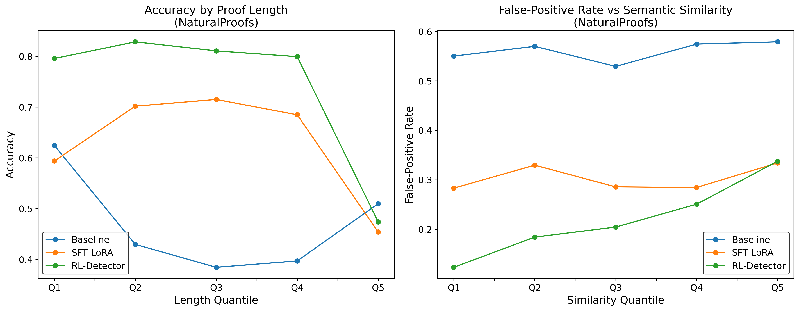
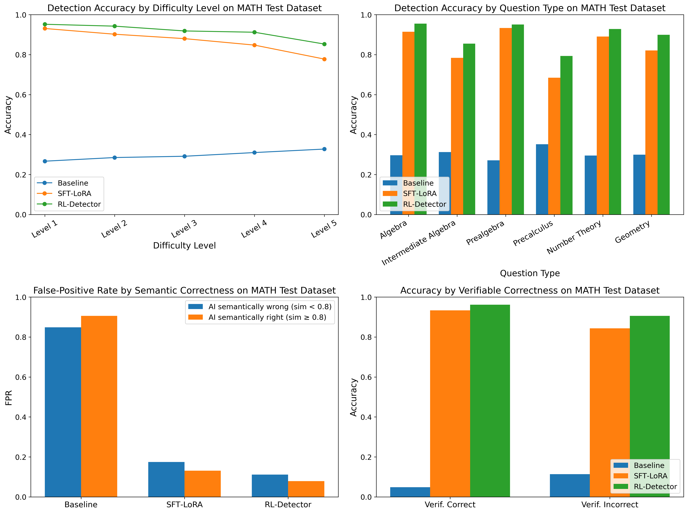

# AI-Generated Math Solution Detector

A state-of-the-art detector for identifying AI-generated mathematical solutions using novel adversarial reinforcement learning techniques. Our approach significantly outperforms traditional methods across varying difficulty levels and mathematical subjects.

## Research Paper

For complete details about our methodology, experiments, and results, please refer to our research paper:

[Adversarial Reinforcement Learning based Detection of AI Generated Math Solutions (PDF)](Adversarial_Reinforcement_Learning_based_Detection_of_AI_Generated_Math_Solutions.pdf)

## Key Results

Our novel RL-Detector demonstrates superior performance and robustness compared to baseline methods:

### Performance Across Mathematical Topics


### Sensitivity Analysis


### Key Findings

- **Difficulty Robustness**: Maintains 85% accuracy on Level 5 problems (vs 78% for SFT-LoRA)
- **Subject Coverage**: Achieves uniformly high accuracy across mathematical subjects, with 10-12 percentage point improvements in challenging areas like Precalculus
- **Reduced False Positives**: Decreases false-positive rate from 13-17% to 8-11% on AI outputs
- **Solution Verification**: 96% accuracy on verifiably correct solutions, 91% on incorrect ones

## Technical Approach

Our method combines:
1. Supervised Fine-Tuning with LoRA (SFT-LoRA) for initial training
2. Adversarial Reinforcement Learning for robustness enhancement
3. Specialized detection mechanisms for mathematical reasoning verification

## Project Structure

```
.
├── config/
│   └── config.yaml         # Configuration settings
├── data/
│   ├── MATH/              # MATH dataset
│   └── processed/         # Processed datasets
├── models/
│   ├── detector_rl/       # RL detector checkpoints
│   └── detector_sft/      # SFT detector checkpoints
├── src/
│   ├── data/             # Data loading/processing
│   ├── models/           # Model architectures
│   ├── training/         # Training loops
│   └── utils/            # Helper functions
├── slurm_scripts/        # HPC job scripts
│   └── README.md         # SLURM usage guide
└── requirements.txt      # Python dependencies
```

## Installation

1. Clone the repository:
```bash
git clone https://github.com/kienyale/CPSC_477_project.git
cd CPSC_477_project
```

2. Set up environment:
```bash
python -m venv venv
source venv/bin/activate  # Linux/Mac
# or
.\venv\Scripts\activate  # Windows

pip install -r requirements.txt
```

## Usage

### Local Development

The detector can be trained and evaluated using our provided scripts. Configuration settings are managed through `config/config.yaml`.

### HPC Deployment

For large-scale training and evaluation, we provide SLURM scripts in the `slurm_scripts/` directory. These scripts are configured for high-performance computing environments and handle:

- Dataset generation
- Model training
- Evaluation across different mathematical domains

Refer to `slurm_scripts/README.md` for detailed HPC deployment instructions.

## Analysis

We provide Jupyter notebooks for detailed analysis:
- `MATH_evaluation_analyses.ipynb`: Comprehensive evaluation on the MATH dataset
- `NaturalProofs_evaluation_analyses.ipynb`: Analysis of performance on mathematical proofs

## Contributing

1. Fork the repository
2. Create feature branch (`git checkout -b feature/name`)
3. Commit changes (`git commit -am 'Add feature'`)
4. Push branch (`git push origin feature/name`)
5. Create Pull Request

## License

This project is licensed under the MIT License - see LICENSE file for details.

